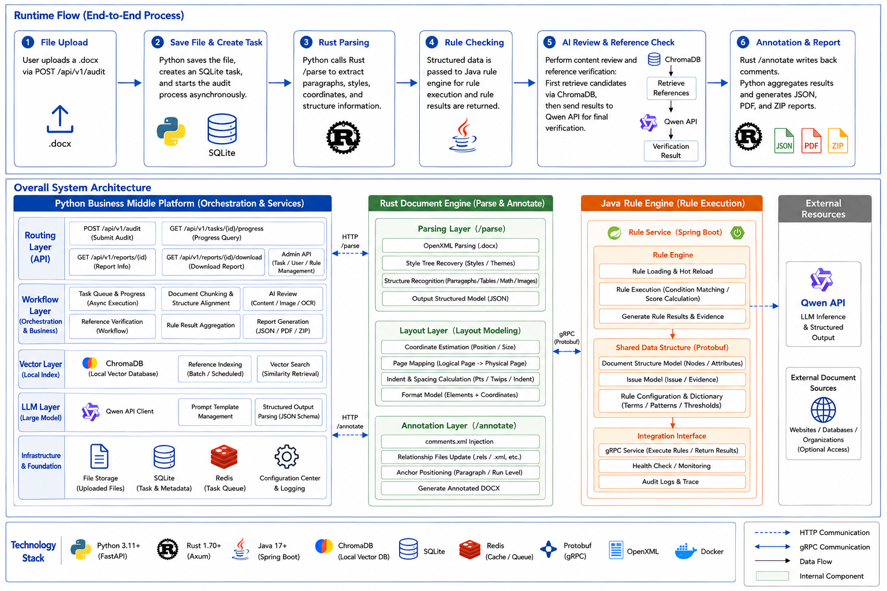

# paper-audit-system

Paper audit system composed of a Python control plane, a Rust document engine, and a Java rules engine. Python handles upload intake, task scheduling, AI review, report generation, downloads, and admin APIs. Rust handles DOCX parsing, layout modeling, and annotation write-back. The Java rules engine handles rule execution and shared protobuf integration. Reference verification uses local ChromaDB retrieval first, then Qwen API for the final verdict.

Chinese version: [README.md](README.md)

## Architecture Overview



---

The core design separates high-cost, highly structured work: Rust handles DOCX structure and comment write-back, Python handles task lifecycle, LLM review, and report delivery, ChromaDB handles local retrieval only, Qwen makes the final decision, and Java provides the rules engine.

## Quick Start

### Initialize

```bash
cp .env.example .env
# Edit .env and fill in QWEN_API_KEY
```

### Run in Development

```bash
uv venv
uv sync --extra dev
uv run main.py
```

If you already have a virtual environment, you can run directly:

```bash
uv run main.py
```

Default listeners after startup:

- Python: `http://127.0.0.1:8000`
- Rust: `http://127.0.0.1:8193` or the port from environment variables

### curl Examples

```bash
curl -X POST "http://127.0.0.1:8000/api/v1/audit" \
  -F "file=@example.docx" \
  -F 'audit_config={"mode":"full","focus_areas":["typo","format","logic","reference"],"style_guide":"GB/T 7714","strictness":3,"max_file_size_mb":50}'
```

```json
{
  "task_id": 31,
  "status": "pending"
}
```

```bash
curl "http://127.0.0.1:8000/api/v1/tasks/1"
curl "http://127.0.0.1:8000/api/v1/report/1"
curl -L "http://127.0.0.1:8000/api/v1/download/1?type=zip" -o task_1.zip
```

```json
{
  "id": 31,
  "file_path": "./uploads/example.docx",
  "status": "processing",
  "progress": 55,
  "result_path": null,
  "error_message": null,
  "current_stage": "ai_review"
}
```

```json
{
  "task_id": 31,
  "source_file": "./uploads/example.docx",
  "issues_count": 3,
  "summary": {
    "chunk_count": 24,
    "reference_count": 5,
    "chunk_issue_count": 3,
    "consistency_issue_count": 0
  }
}
```

```text
Downloaded result: task_31.zip
```

## Overall Architecture

### Runtime Flow

1. The user uploads a `.docx` file through `POST /api/v1/audit`.
2. Python saves the file, creates a SQLite task, and starts the audit workflow asynchronously.
3. Python calls Rust `/parse` to extract paragraphs, styles, coordinates, and structure.
4. Python sends the structured result to the Java rules engine for rule checking and collects the rule findings.
5. Python runs chunk-based review and reference verification; reference verification first retrieves candidates from ChromaDB, then asks Qwen API for the final judgment.
6. Rust `/annotate` writes comments back, and Python merges the Java rule results with AI review results to generate JSON, PDF, and ZIP reports.

### Module Layers

- Python routing layer: audit tasks, progress, reports, downloads, and admin APIs.
- Python workflow layer: task queue, AI review, reference verification, and report aggregation.
- Python vector layer: local ChromaDB indexing and retrieval.
- Python LLM layer: Qwen API client and structured output parsing.
- Rust parsing layer: OpenXML parsing, style recovery, table and equation recognition.
- Rust layout layer: coordinate estimation, page mapping, and indentation conversion.
- Rust annotation layer: comments.xml injection, relationship updates, and comment write-back.
- Java rules layer: rule engine, protobuf integration, and Spring Boot rule service.

## Python Service Layer

### API Endpoints

| Endpoint | Method | Purpose | Typical response |
| --- | --- | --- | --- |
| `/api/v1/audit` | POST | Upload a document and create an audit task | `task_id`, `status: pending` |
| `/api/v1/tasks/{task_id}` | GET | Query task status | Full task object |
| `/api/v1/tasks/{task_id}/progress` | GET | SSE progress stream | `progress: 0-100` |
| `/api/v1/report/{task_id}` | GET | Fetch the JSON report | Audit result |
| `/api/v1/download/{task_id}` | GET | Download ZIP, DOCX, or PDF | Binary file |
| `/health` | GET | Health check and system info | Status, version, metrics |
| `/api/v1/admin/index_paper` | POST | Manually index a paper into ChromaDB | Index result |
| `/api/v1/admin/cleanup` | POST | Clean expired files and old tasks | Cleanup statistics |
| `/api/v1/admin/archive` | POST | Archive completed tasks | ZIP path and task list |

### Task State Machine

Task records are stored in the SQLite `tasks` table and move through these states:

- `pending` -> `parsing`: call Rust `/parse`
- `parsing` -> `analyzing`: receive Rust structured output
- `analyzing` -> `annotating`: finish rules and LLM review
- `annotating` -> `completed`: Rust annotation write-back finishes
- any state -> `failed`: exception, timeout, or external service error

Main fields include `id`, `file_path`, `status`, `progress`, `result_path`, `current_stage`, `checkpoint_data`, `error_log`, and `updated_at`. Recovery prefers checkpoint data to continue unfinished stages.

### AI Review Workflow

The AI review is organized as a LangGraph-style state machine with four parts:

- DocumentSplitter: split chunks by section and character length.
- ParallelChecker: run typo, format, logic, and punctuation checks.
- ReferenceVerifier: inspect reference entries with retrieval and verification.
- ConsistencyChecker: check summary/conclusion alignment and terminology drift.

ReferenceVerifier first retrieves similar papers from local ChromaDB, then sends the reference entry and retrieval results to Qwen API to produce `verified`, `unverified`, or `needs_review`.

### Rule Examples

These samples map directly to the current rules engine and are suitable for acceptance and regression testing:

| Example text | Rule | Notes |
| --- | --- | --- |
| `Abstract:This paper studies panoramic simulation.` | `FORMAT-004` | Missing space after Abstract |
| `Keywords:VirtualReality;ImageStitchingFusion; Unity3D;PanoramaTechnology` | `FORMAT-006`, `FORMAT-005` | Missing space after Keywords; English keyword separators are irregular |
| `杨笛航. 全景视频图像融合与拼接算法研究D]. 浙江:浙江大学,2017.` | `REF-002` | Missing left bracket in the reference type marker |
| `彭凤婷. 基于多全景相机拼接的虚拟现实和实景交互系统[[D]. 四川:电子科技大学,2017.` | `REF-003` | Duplicate bracket in the reference type marker |
| `本研究挺好的，basically 可以说明问题。` | `STYLE-001` | Colloquial or emotional wording |
| `本文认为实验结果较好。` vs. `结论部分完全转向无关主题` | `CONSIST-001` | Weak consistency between abstract and conclusion |
| `CNN 模型在文中首次出现，但未写“卷积神经网络”。` | `CONSIST-002` | Acronym first use lacks the full Chinese name |

### Reference Verification Boundary

Local verification is only a fast screening step:

- If no retrieval result is found, return `unverified` with `no_local_match` instead of guessing.
- If title, author, or year clearly mismatches, prefer `unverified` to avoid false passes.
- If the title is similar but the year differs, mark it as a risk and send it to Qwen or manual review.
- Local verification only uses project ChromaDB results and citation snippets; it does not access the internet or rely on full-text content beyond the bibliography record.
- When `REFERENCE_VERIFIER_BACKEND=auto`, the local path is preferred only when memory meets the threshold; otherwise it falls back to Qwen.

### Long-Document Performance

Long documents are no longer limited to the first 20 chunks:

- Chunk splitting depends on document length and section structure, and the default size is controlled by `LLM_CHUNK_SIZE`.
- Qwen calls are dispatched in batches using `LLM_QWEN_BATCH_SIZE` to avoid overloading the API.
- The rules engine, local verification, and consistency checks all traverse every chunk, including tail sections.
- If you want a local-only quick validation, set `PAPER_AUDIT_FAST_LOCAL_ONLY=1` to skip Qwen calls.
- Processing time grows roughly linearly with the chunk count; the main bottleneck is LLM work, not local rules.

### File Storage

```text
data/
├── uploads/
├── temp/
│   ├── rust_parse/
│   └── rust_output/
├── reports/
│   ├── json/
│   └── pdf/
└── chroma_db/
```

- Uploaded files are kept for 7 days by default.

```json
{
  "title": "Paper title",
  "authors": ["Author 1", "Author 2"],
  "year": 2024,
  "journal": "Journal name",
  "doi": "10.xxxx/xxxxx",
  "source": "arxiv|crossref|user_upload",
  "embedding_model": "simple-hash-embedding-v1"
}
```

### LLM Layer

Qwen API is responsible for three things:

- chunk-level review for typos, formatting, logic, and citation problems
- reference verification, judging whether retrieval results support the entry
- structured JSON parsing for direct storage and report generation in Python

## Tech Stack and Dependencies

### Python

| Component | Purpose |
| --- | --- |
| Python 3.11+ | Runtime |
| uv | Dependency management and startup |
| FastAPI + Uvicorn | HTTP API |
| aiosqlite | Task queue and state persistence |
| httpx | HTTP calls from Python to Rust and Qwen |
| LangGraph | Review workflow orchestration |
| ChromaDB | Local vector retrieval |
| DashScope / Qwen API | Review and reference verification |
| PyMuPDF | PDF report generation |
| LibreOffice / soffice | Base DOCX-to-PDF conversion |
| python-docx | Word document helper |
| python-multipart | File uploads |

### Rust

| Component | Purpose |
| --- | --- |
| Rust 2021 | Build target |
| Axum + Tokio | HTTP service |
| serde + serde_json | JSON communication |
| quick-xml | OpenXML parsing |
| zip | DOCX container read/write |
| docx-rs | Document structure helper |

### Java

| Component | Purpose |
| --- | --- |
| Maven | Build and dependency management |
| Spring Boot | Rule service runtime |
| protoc-jar-maven-plugin | Shared protobuf generation |

### Key Dependencies

- Rust only handles structured document capabilities and does not make review decisions.
- Python handles scheduling, review, reporting, and management APIs.
- Java handles the rule engine and shared protobuf integration.
- Qwen handles semantic judgment and reference verification.
- ChromaDB handles local retrieval and is not the final truth source.

## Configuration

Key entries in `.env`:

```ini
QWEN_API_KEY=sk-your-dashscope-api-key-here
QWEN_BASE_URL=https://dashscope.aliyuncs.com/api/v1
QWEN_MODEL=qwen-max-latest

RUST_HTTP_PORT=8193
RUST_LOG=info
RUST_TEMP_DIR=./temp/rust_engine

PYTHON_UVICORN_PORT=8000
PYTHON_UPLOAD_DIR=./uploads
PYTHON_OUTPUT_DIR=./outputs

CHROMA_PERSIST_DIR=./data/chroma_db
CHROMA_COLLECTION_NAME=academic_papers

SQLITE_DB_PATH=./data/tasks.db
MAX_UPLOAD_SIZE=50
MAX_CONCURRENT_TASKS=3
DEFAULT_ENABLED_MODULES=typo,format,logic,reference
DEFAULT_STRICTNESS=3
```

## Runtime Notes

- After upload, Python creates the task and calls the Rust parsing API first.
- The review stage runs local rules first, then Qwen review and reference verification.
- After completion, JSON, PDF, and ZIP reports are written to `outputs/`.
- Temporary Rust parsing JSON is cleaned up after the task finishes.

### DOCX-to-PDF Environment Check

The PDF report prefers LibreOffice/soffice for base DOCX-to-PDF conversion and then adds annotations. If the base conversion is unavailable, the system falls back to a reconstruction-based render and logs a warning.

### LibreOffice Installation

LibreOffice is a system application, not a Python package, so it cannot be installed with `uv add`. `soffice` is the command-line entry point, and installing LibreOffice usually makes it available automatically.

#### Windows

Recommended install path:

1. Download the Windows package from the LibreOffice website and install it.
2. Keep the default components during installation.
3. Reopen PowerShell and verify with:

```powershell
where.exe soffice.exe
where.exe libreoffice.exe
soffice.exe --version
```

If `where.exe` returns a path and `--version` prints a version number, the installation is successful.

You can also install it via package manager:

```powershell
winget install TheDocumentFoundation.LibreOffice
```

#### Linux

Linux distributions can usually install it through the system package manager:

Ubuntu / Debian:

```bash
sudo apt update
sudo apt install -y libreoffice
```

Fedora:

```bash
sudo dnf install -y libreoffice
```

Arch Linux:

```bash
sudo pacman -S libreoffice-fresh
```

After installation:

```bash
which soffice
which libreoffice
soffice --version
libreoffice --version
```

### Linux Chinese Fonts

When generating PDF comment reports on Linux, missing CJK fonts can cause rendering failures or 404s for downloads. The current project handles this as follows:

- Install font packages: `fonts-wqy-zenhei`, `fonts-wqy-microhei`, `fonts-noto-cjk`
- Font search paths: prefer `/usr/share/fonts/truetype/wqy/wqy-zenhei.ttc`, `/usr/share/fonts/truetype/wqy/wqy-microhei.ttc`, and `/usr/share/fonts/opentype/noto/NotoSerifCJK-Regular.ttc`
- Code fallback: `python_service/paper_audit/api/audit.py` first checks Linux Chinese fonts, then Windows font paths, and finally PyMuPDF built-in fonts

If you deploy on another Linux distribution, make sure the system has usable Chinese font files and that `_resolve_cjk_font_file()` can find them.

## Project Structure

```text
paper-audit-system/
├── main.py
├── pyproject.toml
├── README.md
├── README-en.md
├── .env.example
├── python_service/
│   └── paper_audit/
│       ├── api/
│       ├── core/
│       ├── services/
│       └── main.py
├── engine-java/
└── rust_engine/
    ├── Cargo.toml
    └── src/
```

## Testing

```bash
uv run --extra dev pytest tests/test_api.py -q
```