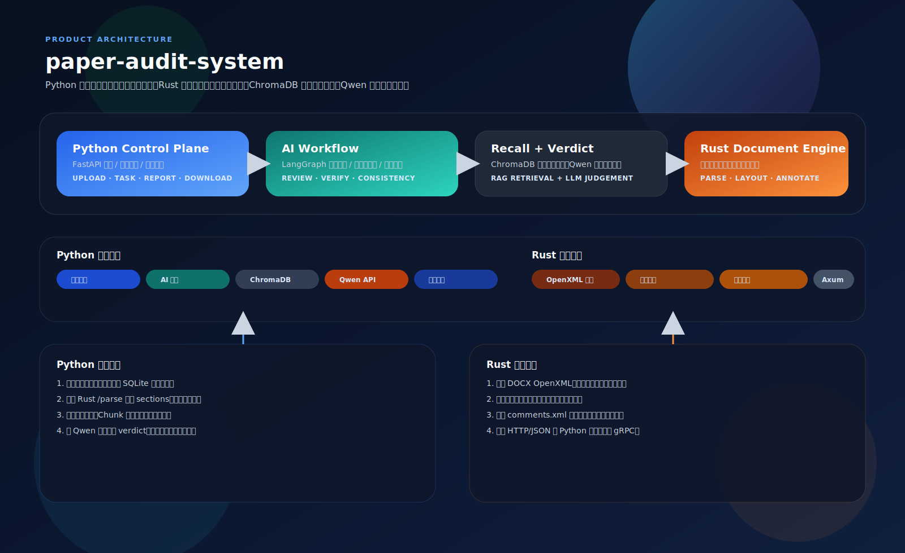

# paper-audit-system

论文审查系统，由 Python 业务中台与 Rust 文档引擎组成。Python 负责上传接收、任务调度、AI 审查、报告生成、下载和管理接口；Rust 负责 DOCX 解析、排版建模与批注回写。文献验证采用本地 ChromaDB 召回候选文献，再由 Qwen API 给出最终核验结论。

## 系统架构全景

下图使用 SVG 绘制，可直接在 README 中缩放查看，也便于后续单独维护。



---

系统的关键设计是把高开销、强结构化的工作拆开：Rust 处理 DOCX 结构与批注写回，Python 处理任务生命周期、LLM 审查和报告交付，ChromaDB 只负责本地召回，Qwen 负责最终判定。

## 快速启动

### 初始化

```bash
cp .env.example .env
# 编辑 .env，填入 QWEN_API_KEY
```

### 开发运行

```bash
uv venv
uv sync --extra dev
uv run main.py
```

如果已经有现成虚拟环境，也可以直接运行：

```bash
uv run main.py
```

启动后默认监听：

- Python：`http://127.0.0.1:8000`
- Rust：`http://127.0.0.1:8193` 或环境变量指定的端口

### curl 示例

```bash
curl -X POST "http://127.0.0.1:8000/api/v1/audit" \
  -F "file=@example.docx" \
  -F 'audit_config={"mode":"full","focus_areas":["typo","format","logic","reference"],"style_guide":"GB/T 7714","strictness":3,"max_file_size_mb":50}'
```

```json
{
  "task_id": 31,
  "status": "pending"
}
```

```bash
curl "http://127.0.0.1:8000/api/v1/tasks/1"
curl "http://127.0.0.1:8000/api/v1/report/1"
curl -L "http://127.0.0.1:8000/api/v1/download/1?type=zip" -o task_1.zip
```

```json
{
  "id": 31,
  "file_path": "./uploads/example.docx",
  "status": "processing",
  "progress": 55,
  "result_path": null,
  "error_message": null,
  "current_stage": "ai_review"
}
```

```json
{
  "task_id": 31,
  "source_file": "./uploads/example.docx",
  "issues_count": 3,
  "summary": {
    "chunk_count": 24,
    "reference_count": 5,
    "chunk_issue_count": 3,
    "consistency_issue_count": 0
  }
}
```

```text
下载结果：task_31.zip
```

## 总体架构

### 运行链路

1. 用户通过 `POST /api/v1/audit` 上传 `.docx`。
2. Python 保存文件，创建 SQLite 任务，并异步启动审查流程。
3. Python 调用 Rust `/parse` 提取段落、样式、坐标和结构信息。
4. Python 执行规则检查、切片审查、参考文献核验。
5. 文献核验时先用 ChromaDB 召回，再把结果交给 Qwen API 做判定。
6. Rust `/annotate` 写回批注，Python 生成 JSON、PDF 和 ZIP 报告。

### 模块分层

- Python 路由层：审查任务、进度、报告、下载和管理接口。
- Python 工作流层：任务队列、AI 审查、参考文献核验、报告汇总。
- Python 向量层：ChromaDB 本地索引与检索。
- Python LLM 层：Qwen API 客户端与结构化输出解析。
- Rust 解析层：OpenXML 解析、样式树恢复、表格与公式识别。
- Rust 排版层：坐标估算、页码映射、缩进换算。
- Rust 批注层：comments.xml 注入、关系文件更新、批注回写。

## 功能模块

### Python 服务层

#### API 端点

| 端点 | 方法 | 作用 | 典型响应 |
| ------ | ------ | ------ | ---------- |
| `/api/v1/audit` | POST | 上传文档并创建审查任务 | `task_id`、`status: pending` |
| `/api/v1/tasks/{task_id}` | GET | 查询任务状态 | 完整任务对象 |
| `/api/v1/tasks/{task_id}/progress` | GET | SSE 进度流 | `progress: 0-100` |
| `/api/v1/report/{task_id}` | GET | 获取 JSON 报告 | 审查结果 |
| `/api/v1/download/{task_id}` | GET | 下载 ZIP、DOCX 或 PDF | 二进制文件 |
| `/health` | GET | 健康检查与系统信息 | 状态、版本、系统指标 |
| `/api/v1/admin/index_paper` | POST | 手动索引论文到 ChromaDB | 索引结果 |
| `/api/v1/admin/cleanup` | POST | 清理过期文件与旧任务 | 清理统计 |
| `/api/v1/admin/archive` | POST | 归档完成任务 | ZIP 路径与任务列表 |

#### 任务状态机

任务记录保存在 SQLite 的 `tasks` 表中，状态按以下链路流转：

- `pending` -> `parsing`：调用 Rust `/parse`
- `parsing` -> `analyzing`：得到 Rust 结构化结果
- `analyzing` -> `annotating`：完成规则和 LLM 审查
- `annotating` -> `completed`：Rust 写回批注完成
- 任意状态 -> `failed`：异常、超时或外部服务错误

主要字段包括 `id`、`file_path`、`status`、`progress`、`result_path`、`current_stage`、`checkpoint_data`、`error_log` 和 `updated_at`；任务恢复时会优先读取 checkpoint 继续未完成阶段。

#### AI 审查工作流

AI 审查由 LangGraph 风格的状态机串起来，实际实现分为四段：

- DocumentSplitter：按章节和字符长度切分 chunk。
- ParallelChecker：执行错别字、格式、逻辑和标点检查。
- ReferenceVerifier：对参考文献做检索与核验。
- ConsistencyChecker：检查摘要与结论、术语漂移等整体一致性。

其中 ReferenceVerifier 的策略是：先用本地 ChromaDB 召回相近论文，再把“参考条目 + 检索结果”交给 Qwen API 输出 `verified`、`unverified` 或 `needs_review`。

#### 规则命中示例

下面这些样例和当前规则引擎实现直接对应，适合用于验收和回归测试：

| 典型文本片段 | 命中规则 | 说明 |
| --- | --- | --- |
| `Abstract:This paper studies panoramic simulation.` | `FORMAT-004` | Abstract 后缺少空格 |
| `Keywords:VirtualReality;ImageStitchingFusion; Unity3D;PanoramaTechnology` | `FORMAT-006`、`FORMAT-005` | Keywords 后缺空格，英文关键词分隔不规范 |
| `杨笛航. 全景视频图像融合与拼接算法研究D]. 浙江:浙江大学,2017.` | `REF-002` | 参考文献类型标记缺少左括号 |
| `彭凤婷. 基于多全景相机拼接的虚拟现实和实景交互系统[[D]. 四川:电子科技大学,2017.` | `REF-003` | 参考文献类型标记括号重复 |
| `本研究挺好的，basically 可以说明问题。` | `STYLE-001` | 命中口语化或情绪化表述 |
| `本文认为实验结果较好。` 与 `结论部分完全转向无关主题` | `CONSIST-001` | 摘要与结论一致性不足 |
| `CNN 模型在文中首次出现，但未写“卷积神经网络”。` | `CONSIST-002` | 缩写首次出现但未给出中文全称 |

#### 参考文献核验边界

本地核验只负责“快速筛查”，边界条件按下面处理：

- 没有召回结果时，直接返回 `unverified` 和 `no_local_match`，不强行猜测。
- 标题、作者、年份明显不一致时，优先给出 `unverified`，避免把错误引用误判为通过。
- 标题相近但年份不一致时，会进入风险标记，交给 Qwen 或人工复核，而不是本地直接放行。
- 本地核验只使用项目内的 ChromaDB 结果和引用文本碎片，不访问外网，也不依赖题录之外的全文内容。
- 当 `REFERENCE_VERIFIER_BACKEND=auto` 时，内存满足阈值才会优先走本地核验，否则回退到 Qwen。

#### 长文档性能说明

长文档审查不再限制在前 20 个 chunk：

- chunk 切分由文档长度和章节结构决定，默认大小由 `LLM_CHUNK_SIZE` 控制。
- Qwen 调用按 `LLM_QWEN_BATCH_SIZE` 批次并发，避免长文档一次性压垮接口。
- 规则引擎、本地核验和一致性检查都会遍历全部 chunk，不会跳过尾部章节。
- 如果只想在本机做快速验证，可以启用 `PAPER_AUDIT_FAST_LOCAL_ONLY=1`，跳过 Qwen 调用。
- 处理时间基本随 chunk 数线性增长，长文档的瓶颈主要在 LLM 而不是本地规则检查。

#### 文件存储

```text
data/
├── uploads/
├── temp/
│   ├── rust_parse/
│   └── rust_output/
├── reports/
│   ├── json/
│   └── pdf/
└── chroma_db/
```

- 上传文件默认保留 7 天。
- 临时 Rust 解析 JSON 在任务完成后删除。
- 报告默认保留 30 天，可归档。

### Rust HTTP 引擎

Rust 服务是纯 HTTP 接口，默认监听 `http://localhost:8080`，主要负责三个端点：

- `GET /health`：返回健康状态、版本和系统信息。
- `POST /parse`：解析 DOCX，输出 sections、metadata、temp_output_path。
- `POST /annotate`：把 issues 写回原始 DOCX，生成带批注文件。

内部模块可以概括为三层：

| 模块 | 输入 | 输出 | 作用 |
| ------ | ------ | ------ | ------ |
| Parser | `word/document.xml`、`word/styles.xml` | `Section`、`StyleTree` | 提取结构、样式和文本 |
| LayoutModeler | 段落高度、行距、页面参数 | 坐标、页码、缩进 | 估算排版位置 |
| Annotator | `issues`、原始 DOCX | 带批注 DOCX | 生成 comments.xml 并回写 |

### 向量数据库层

ChromaDB 用于本地文献召回，集合名默认是 `academic_papers`。它的作用不是最终判定，而是给 Qwen 提供更准确的上下文。

元数据结构如下：

```json
{
  "title": "论文标题",
  "authors": ["作者1", "作者2"],
  "year": 2024,
  "journal": "期刊名",
  "doi": "10.xxxx/xxxxx",
  "source": "arxiv|crossref|user_upload",
  "embedding_model": "simple-hash-embedding-v1"
}
```

### LLM 层

Qwen API 负责三件事：

- chunk 级审查，输出错别字、格式、逻辑和引用问题。
- 文献核验，判断召回结果是否支撑参考条目。
- 结构化 JSON 输出解析，便于 Python 直接入库和生成报告。

## 技术栈与依赖

### Python

| 组件 | 用途 |
| ------ | ------ |
| Python 3.11+ | 运行环境 |
| uv | 依赖管理与启动入口 |
| FastAPI + Uvicorn | HTTP API |
| aiosqlite | 任务队列与状态持久化 |
| httpx | Python 到 Rust、Qwen 的 HTTP 调用 |
| LangGraph | 审查工作流编排 |
| ChromaDB | 本地向量召回 |
| DashScope / Qwen API | 审查与文献核验 |
| PyMuPDF | PDF 报告生成 |
| python-docx | Word 辅助处理 |
| python-multipart | 文件上传 |

### Rust

| 组件 | 用途 |
| ------ | ------ |
| Rust 2021 | 编译目标 |
| Axum + Tokio | HTTP 服务 |
| serde + serde_json | JSON 通信 |
| quick-xml | OpenXML 解析 |
| zip | DOCX 容器读写 |
| docx-rs | 文档结构辅助 |

### 关键依赖关系

- Rust 只处理结构化文档能力，不承担审查决策。
- Python 负责调度、审查、报告和管理接口。
- Qwen 负责语义判断与引用核验。
- ChromaDB 负责本地召回，不承担最终真伪裁决。

## 配置管理

`.env` 中的关键配置如下：

```ini
QWEN_API_KEY=sk-your-dashscope-api-key-here
QWEN_BASE_URL=https://dashscope.aliyuncs.com/api/v1
QWEN_MODEL=qwen-max-latest

RUST_HTTP_PORT=8193
RUST_LOG=info
RUST_TEMP_DIR=./temp/rust_engine

PYTHON_UVICORN_PORT=8000
PYTHON_UPLOAD_DIR=./uploads
PYTHON_OUTPUT_DIR=./outputs

CHROMA_PERSIST_DIR=./data/chroma_db
CHROMA_COLLECTION_NAME=academic_papers

SQLITE_DB_PATH=./data/tasks.db
MAX_UPLOAD_SIZE=50
MAX_CONCURRENT_TASKS=3
DEFAULT_ENABLED_MODULES=typo,format,logic,reference
DEFAULT_STRICTNESS=3
```

## 运行说明

- 上传文件后，Python 会先创建任务，再调用 Rust 解析接口。
- 审查阶段会先执行本地规则，再执行 Qwen 审查和文献核验。
- 任务完成后，报告 JSON、PDF 和 ZIP 会输出到 `outputs/`。
- 临时 Rust 解析 JSON 会在任务结束后清理。

### Linux 中文字体说明

在 Linux 服务器上生成 PDF 批注报告时，如果系统没有宋体/黑体，可能会导致 PDF 渲染失败或下载接口返回 404。当前项目已经按下面方式处理：

- 安装字体包：`fonts-wqy-zenhei`、`fonts-wqy-microhei`、`fonts-noto-cjk`
- 字体查找路径：优先使用 `/usr/share/fonts/truetype/wqy/wqy-zenhei.ttc`、`/usr/share/fonts/truetype/wqy/wqy-microhei.ttc`、`/usr/share/fonts/opentype/noto/NotoSerifCJK-Regular.ttc`
- 代码回退策略：`python_service/paper_audit/api/audit.py` 会先查找 Linux 中文字体，找不到时再回退到 Windows 字体路径，最后再使用 PyMuPDF 内置字体

如果你在其他 Linux 发行版上部署，只要保证系统里有可用的中文字体文件，并让 `_resolve_cjk_font_file()` 能搜到对应路径即可。

## 项目结构

```text
paper-audit-system/
├── main.py
├── pyproject.toml
├── README.md
├── .env.example
├── python_service/
│   └── paper_audit/
│       ├── api/
│       ├── core/
│       ├── services/
│       └── main.py
└── rust_engine/
    ├── Cargo.toml
    └── src/
```

## 测试

```bash
uv run --extra dev pytest tests/test_api.py -q
```
